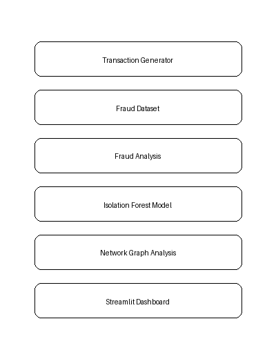
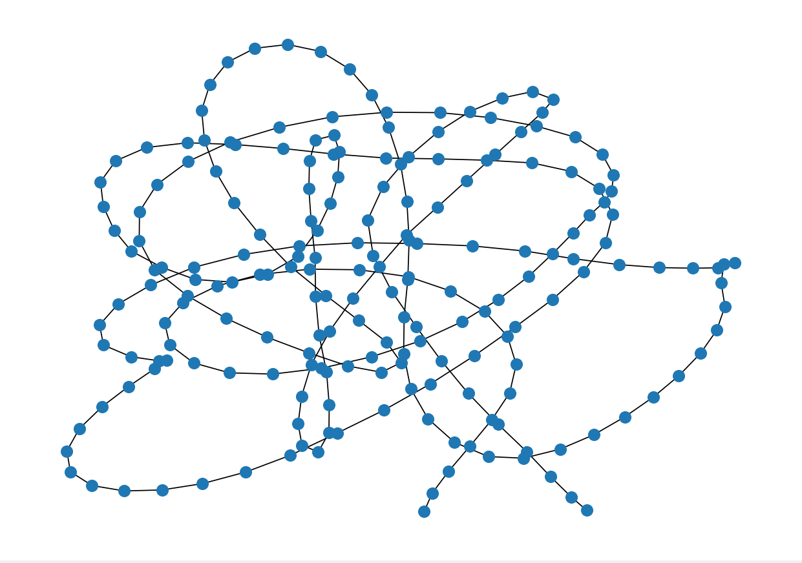

# UPI Fraud Pattern Intelligence System


> Fraud does not always look dramatic. It looks almost normal — just slightly off.  
> This system is built to catch exactly that.

---

## What This Project Does

UPI fraud rarely announces itself. It hides in timing, in transaction volume, in networks of accounts that seem unrelated until you map them.

This system analyzes 50,000 synthetic UPI transactions to surface those hidden patterns — using machine learning to detect anomalies, graph theory to expose suspicious networks, and a live dashboard to make the findings actionable.

---

## System Architecture



```
Data Generation  →  Pattern Analysis  →  Anomaly Detection  →  Network Mapping  →  Dashboard
```

---

## Project Structure

```
upi-fraud-intelligence-system/
│
├── src/
│   ├── generate_data.py          # Generates 50,000 synthetic UPI transactions
│   ├── anomaly_detection.py      # Isolation Forest — flags suspicious transactions
│   └── network_analysis.py       # NetworkX — maps transaction flow graphs
│
├── dashboard/
│   └── app.py                    # Streamlit — interactive fraud intelligence dashboard
│
├── data/
│   ├── transactions.csv                 # Raw transaction dataset
│   └── transactions_with_anomalies.csv  # Enriched dataset with anomaly labels
│
├── images/
│   ├── architecture.png
│   ├── dashboard_demo.gif
│   └── transaction_network_graph.png
│
├── notebooks/
│   └── analysis.py               # Exploratory data analysis
│
├── requirements.txt
└── LICENSE
```

---

## Detection Approach

**Isolation Forest** is used to detect anomalous transactions — an algorithm that identifies outliers by isolating them from the rest of the data. Fraudulent transactions, being rare and statistically unusual, are isolated faster than legitimate ones.

Features used for detection:
- Transaction amount
- Hour of transaction

Flagged transactions are exported to `transactions_with_anomalies.csv` with an anomaly score and boolean flag for each record.

---

## Transaction Network Graph



Every transaction is modeled as a directed edge between two nodes (sender → receiver) using **NetworkX**.

This reveals:
- Accounts with abnormally high transaction degrees
- Circular fund flows between accounts
- Clusters indicative of coordinated fraud rings

---

## Dashboard


Built with **Streamlit**, the dashboard presents:

- Total transaction volume and fraud rate
- State-wise fraud distribution across India
- Hourly fraud activity patterns
- ML-flagged suspicious transactions

---

## Dataset

Synthetic dataset of **50,000 UPI transactions**, generated to reflect real-world fraud distribution (~3% fraud rate).

| Field | Description |
|---|---|
| `transaction_id` | Unique transaction identifier |
| `amount` | Transaction amount in INR |
| `hour` | Hour of transaction (0–23) |
| `state` | Origin state in India |
| `device` | Device type used |
| `fraud_flag` | Ground truth label (1 = fraud) |

---

## Getting Started

```bash
# Clone the repository
git clone https://github.com/yourusername/upi-fraud-intelligence-system.git
cd upi-fraud-intelligence-system

# Install dependencies
pip install -r requirements.txt

# Run the pipeline
python src/generate_data.py
python src/anomaly_detection.py
python src/network_analysis.py

# Launch the dashboard
streamlit run dashboard/app.py
```

---

## Tech Stack

| Tool | Purpose |
|---|---|
| Python | Core language |
| Pandas & NumPy | Data processing |
| scikit-learn | Anomaly detection |
| NetworkX | Graph analysis |
| Matplotlib | Visualization |
| Streamlit | Dashboard |

---

## Future Scope

- Real UPI transaction datasets for model validation
- Advanced detection — XGBoost, LSTM for sequential patterns
- Live transaction monitoring pipeline
- Community detection algorithms for fraud ring identification
- Enhanced dashboard filters and drill-down capabilities

---

## License

MIT License — see [LICENSE](LICENSE) for details.

---

## Author

**Aanshi Gupta** — Computer Science Student  
[GitHub](https://github.com/aanshigupta)

---

> *Built to understand how fraud hides — and how data can find it.*
