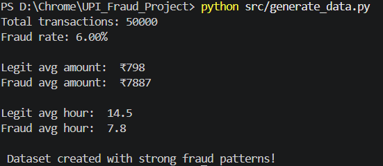
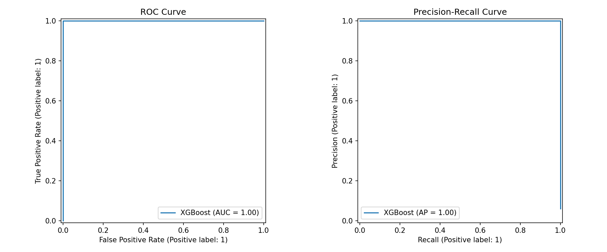
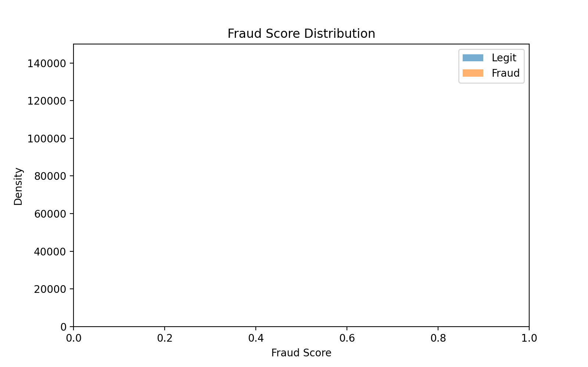
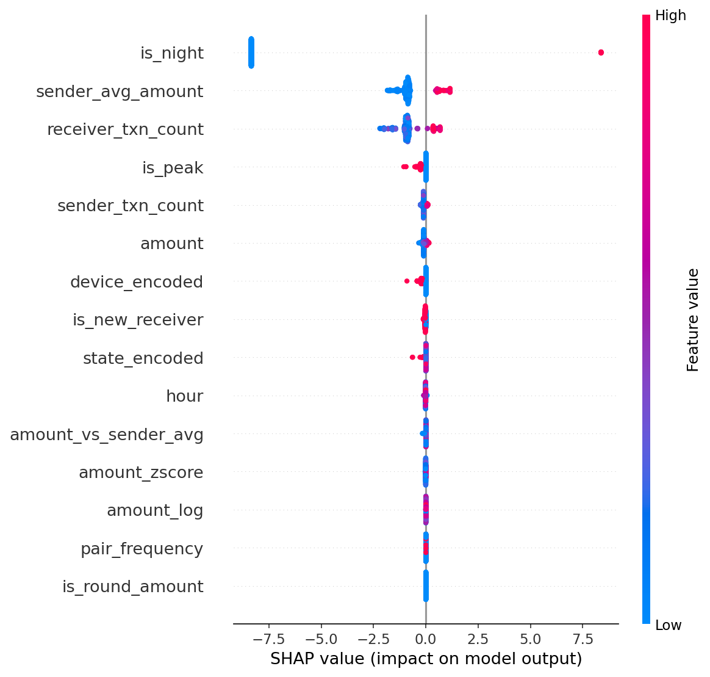
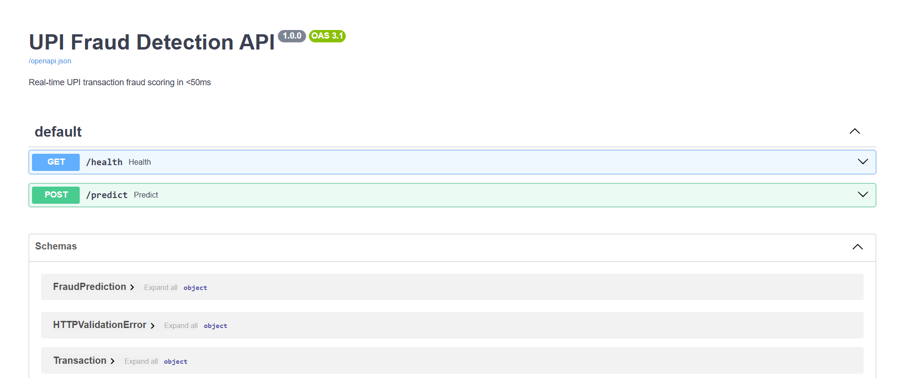

# UPI Fraud Pattern Intelligence System


> *Fraud does not always look dramatic.*  
> *It looks almost normal — just slightly off.*

This system is designed to detect exactly that.

---

## 📌 Overview

Digital payment platforms process **millions of transactions daily**. Traditional rule-based fraud detection systems struggle to keep pace with evolving fraud patterns.

The **UPI Fraud Pattern Intelligence System** is a production-style machine learning pipeline that simulates how fintech fraud detection systems operate. It combines behavioral feature engineering, gradient boosting models, anomaly detection, graph analytics, and a real-time scoring API to identify suspicious UPI transactions.

---

## ⭐ Key Highlights

- Synthetic dataset of **50,000 UPI transactions**
- **15+ engineered behavioral features**
- **XGBoost fraud detection model**
- **Isolation Forest anomaly detection**
- **Network graph analysis for fraud ring discovery**
- **FastAPI real-time scoring endpoint**
- **Two Streamlit dashboards** (analytics + live prediction)
- **SHAP model explainability**
- **Automated testing and CI/CD pipeline**

---

## 🏗️ System Architecture

```plaintext
Transaction Input/User
       ↓
FastAPI API (/predict)
       ↓
Feature Engineering & Transaction Analytics
       ↓
XGBoost Fraud Model (Risk Prediction Engine)
       ↓
Fraud Score + Risk Classification
       ↓
Streamlit Dashboard (Fraud Intelligence View)
```

---

## 📁 Project Structure

```
upi-fraud-intelligence-system/
│
├── .github/
│   └── workflows/
│       └── ci.yml                      # GitHub Actions CI/CD pipeline
│
├── api/
│   ├── __init__.py
│   └── main.py                         # FastAPI real-time scoring endpoint
│
├── dashboard/
│   ├── app.py                          # Analytics dashboard
│   └── live_dashboard.py               # Live prediction dashboard
│
├── data/
│   ├── transactions.csv                # Raw synthetic dataset (50,000 rows)
│   └── transactions_with_anomalies.csv # Enriched with model outputs
│
├── images/                             # Screenshots, diagrams, demo GIFs
│
├── models/
│   ├── feature_list.pkl                # Serialized feature column order
│   └── xgboost_fraud.pkl               # Trained XGBoost model
│
├── notebooks/
│   └── analysis.py                     # Exploratory data analysis
│
├── src/
│   ├── anomaly_detection.py            # Isolation Forest anomaly scoring
│   ├── fraud_model.py                  # XGBoost training pipeline + SHAP
│   ├── fraud_rings.py                  # Fraud ring detection
│   ├── generate_data.py                # Synthetic data generation
│   └── network_analysis.py             # NetworkX transaction graph
│
├── tests/
│   └── test_model.py                   # Automated test suite
│
├── .gitignore
├── requirements.txt
└── README.md
```

---

## 🔍 How It Works

### 1. Synthetic Data Generation

`src/generate_data.py`

Real financial datasets are private, so the system generates a synthetic dataset representing **50,000 UPI transactions** with an approximate **6% fraud rate**.

Fraud patterns simulated:

- High transaction amounts
- Late-night transactions
- Higher-risk device usage
- Suspicious sender–receiver behavior



---

### 2. Feature Engineering

The model is trained on **15+ behavioral features** derived from raw transaction attributes.

| Feature | Description |
|---|---|
| `amount_log` | Log-transformed transaction amount |
| `amount_zscore` | Amount deviation relative to sender history |
| `is_round_amount` | Flag for suspicious round-number transfers |
| `sender_txn_count` | Number of transactions sent |
| `sender_avg_amount` | Average sender transaction amount |
| `receiver_txn_count` | Number of transactions received |
| `pair_frequency` | Sender–receiver transaction frequency |
| `is_new_receiver` | Receiver not previously seen by sender |
| `device_encoded` | Encoded device channel |
| `state_encoded` | Encoded origin state |

These behavioral signals allow the model to detect patterns that simple rules often miss.

---

### 3. Machine Learning Model

`src/fraud_model.py`

Fraud classification is implemented using **XGBoost**, a gradient boosting algorithm well suited for tabular financial data.

Enhancements used:

- **SMOTE** to address class imbalance
- **Precision–Recall evaluation**
- **Feature importance analysis**

Each transaction receives a fraud probability score, a binary classification (fraud / non-fraud), and a risk level of `LOW`, `MEDIUM`, or `HIGH`.

<div align="center" style="display:flex; gap:10px;">
  
  
</div>
---

### 4. Anomaly Detection

`src/anomaly_detection.py`

An **Isolation Forest** model runs independently of XGBoost to detect statistical anomalies — useful for catching novel fraud patterns the supervised model has not been trained on.

---

### 5. Model Explainability

`src/fraud_model.py`

The project uses **SHAP (SHapley Additive Explanations)** to explain every prediction. Analysts can see exactly which features drove a fraud score up or down, not just that a transaction was flagged.



Key drivers:

- Transaction amount deviation from sender history
- Transaction hour and time-of-day patterns
- Sender velocity and behavioral baseline
- Receiver exposure and pair frequency

---

### 6. Fraud Network Analysis

`src/network_analysis.py` · `src/fraud_rings.py`

Transactions are modeled as a directed graph using **NetworkX** where nodes are UPI accounts and edges are transactions. This exposes:

- Accounts with abnormally high transaction volume
- Circular money flows between a closed set of accounts
- Coordinated fraud clusters and ring structures


---

### 7. Real-Time Fraud Scoring API

`api/main.py`

A real-time fraud scoring API built with **FastAPI**.

**Endpoint**

```
POST /predict
```

**Example Request**

```json
{
  "amount": 15000,
  "hour": 2,
  "sender_id": "user_0012",
  "receiver_id": "user_0491",
  "device": "Web",
  "state": "UP"
}
```

**Example Response**

```json
{
  "fraud_score": 0.97,
  "is_fraud": true,
  "risk_level": "HIGH",
  "latency_ms": 7
}
```

Interactive API docs at `http://127.0.0.1:8000/docs`



---

### 8. Interactive Dashboards

Two independent Streamlit dashboards serve different purposes — one for exploring historical fraud data, one for scoring transactions in real time.

---

#### 📊 Analytics Dashboard

**File:** `dashboard/app.py`

A retrospective view over the full enriched transaction dataset. Displays fraud KPIs, state-wise geographic distribution, hourly activity patterns, SHAP feature importance, the transaction network graph, and a filterable table of all flagged records.

> 🔗 **[Launch Analytics Dashboard →](https://upi-fraud-intelligence-system-analytics-dashboard.streamlit.app/)**


---

#### 🎯 Live Prediction Dashboard

**File:** `dashboard/live_dashboard.py`

An interactive form where you input a raw transaction — amount, hour, sender, receiver, device, state — and instantly receive a fraud score, risk level, and SHAP waterfall chart explaining exactly why the transaction was flagged or cleared.

> 🔗 **[Launch Live Prediction Dashboard →](https://upi-fraud-intelligence-system-live-dashboard.streamlit.app/)**


---

## ⚙️ Getting Started

**Installation**

```bash
git clone https://github.com/gupta-aanshi/upi-fraud-intelligence-system.git
cd upi-fraud-intelligence-system
pip install -r requirements.txt
```

**Running the Pipeline**

```bash
# Generate synthetic dataset
python src/generate_data.py

# Train the fraud detection model
python src/fraud_model.py

# Run anomaly detection
python src/anomaly_detection.py

# Build transaction network graph
python src/network_analysis.py

# Start FastAPI server
uvicorn api.main:app --reload

# Launch Streamlit dashboards
streamlit run dashboard/app.py
streamlit run dashboard/live_dashboard.py
```

---

## ✅ Testing

```bash
pytest tests/
```

Tests validate model loading, prediction outputs, fraud rate sanity, and feature engineering integrity.

---

## 🔄 CI/CD Pipeline

A **GitHub Actions workflow** runs automatically on every push to `main`:

1. Installs dependencies
2. Generates synthetic data
3. Trains the fraud detection model
4. Runs the full automated test suite

---

## 🛠️ Tech Stack

| Category | Tools |
|---|---|
| Machine Learning | scikit-learn, XGBoost, imbalanced-learn |
| Explainability | SHAP |
| Graph Analysis | NetworkX |
| Data Processing | pandas, NumPy |
| Visualization | Matplotlib |
| API | FastAPI, Uvicorn |
| Dashboard | Streamlit |
| Testing | pytest |
| CI/CD | GitHub Actions |

---

## 📄 License

This project is licensed under the **MIT License** — you are free to use, modify, and distribute this code for personal, academic, or commercial purposes, provided the original license and copyright notice are included.

See the [LICENSE](LICENSE) file for the full terms.

---

## 👤 Author

**Aanshi Gupta**  
[github.com/gupta-aanshi](https://github.com/gupta-aanshi)

---

*Built to find what looks almost normal — but isn't.*